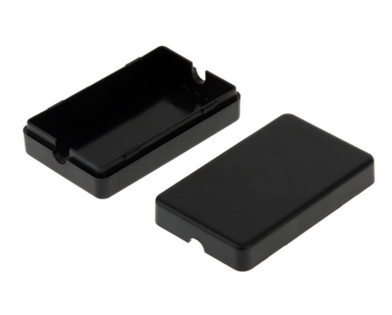
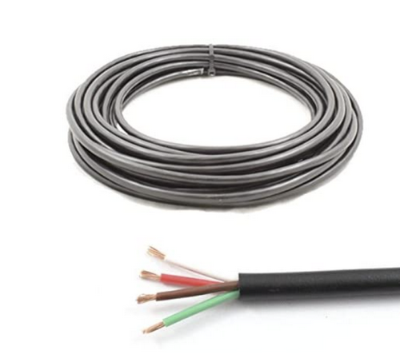

# esph_bedroom.yaml

This ESP32 board connects via two separate GPO pins to two [pressure pads](https://www.amazon.co.uk/gp/product/B0045U4MNC) that are placed under my mattress for presence detection. This is incredibly useful to trigger automations at bed time or in the morning when getting up.

## Ingredients
| Item | Photo |
|------|-------|
|[ESP-WROOM-32](http:/www.amazon.co.uk/gp/product/B08DR5T897)|  |
|[ESP enclosure or case](https://www.amazon.co.uk/gp/product/B06XKDFRJ9)|  |
|2 x [Pressure pads](https://www.amazon.co.uk/gp/product/B0045U4MNC). These are designed for placing under a door mat which when stepped on would trigger a chime. I have placed these under each side of my beds mattress.|  |
|[2 pin male/female wire connector](https://www.amazon.co.uk/gp/product/B07KMZH2GQ)|  |
| [Four-core cable](https://www.amazon.co.uk/Core-Cable-Rated-Trailer-Lights/dp/B0772XMDMG) |  |

## Method
1. I soldered two of the wires from the four-core cable to the ```gnd``` pin and then the other two wires to pin ```GPIO4``` and ```GPIO16``` on the ESP32.
1. At the other end of the four-core cable I soldered the two wires connected to the ```gnd``` wire to the ```gnd``` of two female connectors.
1. I then soldered one of each of the GPIO pin wires to the ```positive``` wire of each of the two female connectors. 
1. All of my joins are covered in heat shrink leaving me with a strong and shielded cable.
1. The two female connectors are connected to the two pressure pads under the mattress creating a ```Left``` and ```Right``` zone.
1. The ESP32 is powered via a micro USB cable from a wall plug socket with USB power ports.

## Home Assistant
- I use the ```binary_sensor``` to trigger automations such as changing the active scene used in the bedroom as well as automatic alarm arming and disarming.
- They are also a useful condition to avoid my blind automation from opening the blinds while someone is still in bed.